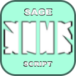

 
<h3 align="center">SageWallScript</h3>

 

    <tr>
        <td>
            
        </td>
        <td>
            
        </td>
    </tr>
    
    
     
    
    
  

        This script is timing when you have to place the wall for your wall boost.
     
     
  

 

## How to install?

The Steps are really easy.

> 1. Download the latest release.
> 2. Unzip the .zip file.
> 3. Run the "Sage Wall Script.exe"
> 4. At the 1st run it will ask for your "Script key", that actually the keybind for the scrip.
> 5. Open Valorant and bind your 2nd slot of fire button to 'P'.

If you dont prefer the 'P' key you can write over it in source code ;)
There are chance i will create configure for this.

Well Done, you installed my program :D

 

## How to use it?

> 1. Take out your Sage wall in-game.
> 2. Press the "Script Key".
___

  

 

## What am i using for ?

> I personaly like to use it for walls that i learned from [Grimm](https://www.twitch.tv/grimm).

 

### Discord: Krist..#1394
### Valorant Profile: f | Asta#00000
